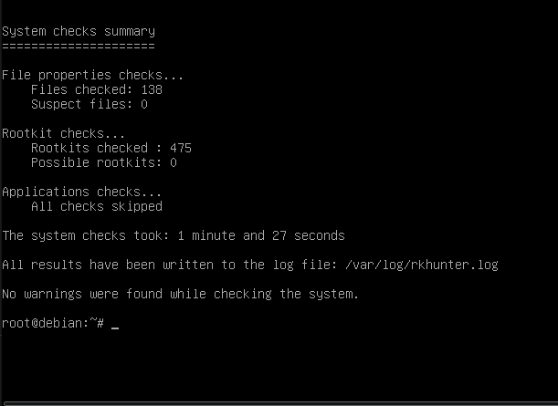

# **Herramienta de comprobación de integridad de ficheros**

# **Rkhunter:**

Esta herramienta nos permite poder comprobar la integridad de nuestro sistema, descubrir si hay un tipo de rootkit instalado en nuestro sistema , rastrear posibles puertas traseras, vulnerabilidades del sistema incluso detectar permisos incorrectos

## **Instalamos rkhunter:**

`sudo apt install rkhunter`

## **Configuramos rkhunter:**

`nano /etc/rkhunter.conf`

Y editamos las siguientes líneas de la siguiente manera:

UPDATE\_MIRRORS=1

MIRRORS\_MODE=0

WEB\_CMD=""

Ahora procedemos a activar crontab para que rkhunter haga un chequeo diario:

`nano /etc/default/rkhunter.conf`

Editamos las siguientes líneas: De esta manera se ejecutará diariamente en nuestro sistema y se nos actualizará la base de datos donde guarda el log del escaneo.

CRON\_DAILY\_RUN="true"

CRON\_DB\_UPDATE="true"

APT\_AUTOGEN="true"

Luego crearemos un script para automatizar el chequeo en /etc/cron.daily

Por último haremos que crontab ejecute este script todos los días a una hora determinada, para ello editamos el fichero /etc/crontab

En mi caso se ejecutará todos los días a las 10:30

Por último hacemos el chequeo manual para comprobar el funcionamiento de rkhunter con el siguiente comando:

`rkhunter -c`

Mi sistema de fichero está estable.

---

## **Uso Desatendido**

Para su uso desatendido ejecutaremos el siguiente comando:

`rkhunter -c -sk`

## **Alertas Correo**

Para configurar las alertas y que la envie a un correo debemos de tocar el siguiente fichero:

`nano /etc/rkhunter.conf`

Y editamos la siguiente línea

MAIL-ON-WARNING=root@localhost

Podemos poner un correo cualquiera, o que simplemente se lo notifique a root.

Para crear una snaphot de nuestro sistema de fichero debemos de ejecutar:

`rkhunter --propupd`

Básicamente lo que hacemos es calcular el hash de los ficheros del sistema en el punto en el que ejecutamos el comando obviamente

---

# Tripwire

Tripwire sirve para prácticamente lo mismo que rkhunter, aunque hay que decir que es un poco menos intuitivo de usar.

## **Instalamos Tripwire:**

`sudo apt install tripwire`

Una vez instalado, tenemos que configurar nuestra clave para usar este binario:

Nos crea el fichero de configuración por defecto

Introducimos la clave que usaremos.

