# **Herramienta de comprobación de fortaleza de contraseñas**

# **John The Ripper**

Es una herramienta de software gratuita para descifrar contraseñas, desarrollada por Openwall. En un principio fue desarrollado para sistemas operativos Unix, pero más tarde también se desarrolló para otras plataformas. Es uno de los programas de prueba y ruptura de contraseñas más populares, ya que combina varios crackers de contraseñas en un solo paquete, detecta automáticamente los tipos de hash de contraseñas e incluye un cracker personalizable. Se puede ejecutar con varios formatos de contraseña cifrada, incluidos varios tipos de hash de contraseña cifrada que se encuentran comúnmente en Linux o Windows.

**¿Cómo funciona John The Ripper?**

John tiene cuatro modos de funcionamiento, más adelante veremos cada uno en detalle. Si no se especifica el modo que se quiere utilizar, la herramienta ejecutará todos los modos en el siguiente orden, por defecto.

- Single crack: La herramienta utiliza el nombre del usuario para generar diferentes combinaciones y generar su código hash para compararlo con el que está intentando romper o crackear. En muchas ocasiones, las personas utilizan su mismo nombre de usuario o una variación del mismo como contraseña, por eso, esto es lo primero que prueba.

- Diccionario: Este modo, implica una lista de palabras predeterminadas que puede adquirirse de diferentes formas. Existen diccionarios que son famosos como rockyou.txt y koanashi, también pueden ser creados a partir de una base de datos filtrada.

- Incremental: El modo incremental, intenta crackear la contraseña mediante un ataque de fuerza bruta, de acuerdo a ciertas reglas definidas por el sistema.

- Externo: Como su nombre indica, se usa un software externo a la herramienta, el cual deberá estar escrito en C y se usa para ejecutar ataques de fuerza bruta siguiendo los lineamientos que estén inscritos en dicho programa.

Ahora que hemos visto cómo funciona, veremos cómo se utiliza.

**¿Cómo utilizar John The Ripper?**

Voy a usar un escenario con una máquina virtual Debian, tendrá John instalado y haré varios usuarios con distintas contraseñas y a partir del /etc/passwd y /etc/shadow veremos como crackear las contraseñas. 

---

## **Instalación**

Para instalarlo en Debian, basta con ejecutar:

`	 # sudo apt install john`

## **G**enerar Dicc**

Suponemos que hemos conseguido tener un acceso root y hemos conseguido una copia de los ficheros /etc/passwd y /etc/shadow. Tenemos 30 usuarios y sus respectivos hashes de contraseñas. Ahora fusionamos  ambos ficheros con el comando unshadow.

`	 # cp /etc/passwd ./passwd.txt`

`	 # cp /etc/shadow ./shadow.txt`

`    # unshadow passwd.txt shadow.txt > nombrefichero`

## **Demo Brute**

Una vez hayamos fusionado el fichero, empezaremos probando el primer método el cual es single crack. 

Para ejecutar john en modo single usamos el siguiente comando:

`	 # sudo john --single nombrefichero`

Para ver los hashes crackeados se usa el siguiente comando

`	 # sudo john --show nombreficher`

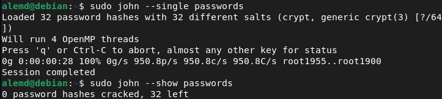


como podemos ver con single crack no ha crackeado ninguna contraseña, debido a que el nivel de las contraseñas son medianamente fuertes. He usado el comando pwgen para generarlas.

## **Demo Dicc**

Ahora que ya hemos utilizado el modo single crack, probaremos el modo diccionario.

Para usar John con un diccionario, tenemos que usar este comando:
```
 	 # sudo john --wordlist=/ruta/del/diccionario.txt  - -format=crypt nombrefichero
```

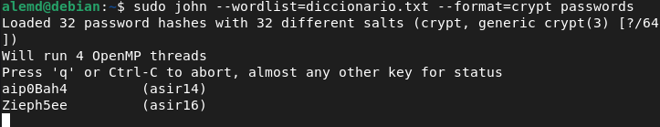

Como se puede ver en la captura, lleva 2 contraseñas crackeadas y entre paréntesis el nombre de los usuarios. Este es un modo el cual requiere mucho tiempo ya que depende de la potencia de la máquina.

En la siguiente captura podemos observar las contraseñas crackeadas y el tiempo que ha necesitado para ello.

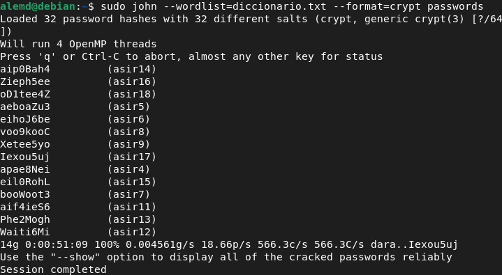

A continuación probaremos el modo incremental, que usa unas reglas definidas por sistema para realizar un ataque de fuerza bruta.

El comando usado para el modo incremental es el siguiente:

`	 # sudo john --incremental --format=crypt nombrefichero`

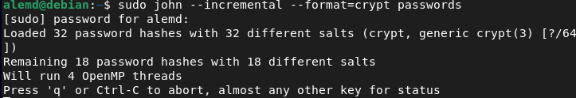


Por último veremos el funcionamiento del modo externo, para ello, debemos usar el modo   - -external:nombre donde nombre es el nombre del programa que vamos a usar. A continuación dejo el comando que he usado:

`	 # john --external:LanMan passwords`

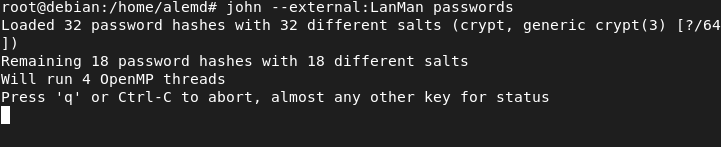

## **Funcionamiento en Windows**

Para crackear contraseñas de usuarios en Windows, necesitamos obtener los hashes de las contraseñas. Para ello, usaremos en la máquina windows la herramienta mimikatz.

Una vez descargado mimikatz, elevamos los privilegios con el siguiente comando.

`   # token::elevate`

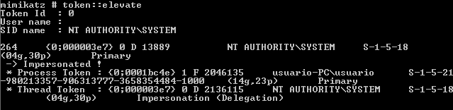

Al ejecutar este comando, nos muestra los hashes NTML y los nombres de usuario.

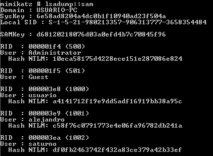

Una vez obtenidos los hashes, utilizaremos John para crackearlos. Hemos instalado john en Windows y probaremos a crackear la contraseña de los usuarios.

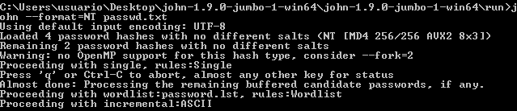

## **Funcionamiento en Apache2.**

Para atacar a un servidor apache con John, tenemos que atacar al archivo htpasswd, es una utilidad que tiene por función almacenar contraseñas de forma cifrada para ser utilizadas por Apache en servicios de autenticación. Su uso nos permitiría mostrar determinados directorios o archivos vía http solo a usuarios identificados y sin que necesariamente estén a libre disposición de todo el mundo.

Primero configuraremos el servidor apache, para crear un usuario con contraseña usaremos el siguiente comando:

`	 # htpasswd -c /home/usuario/.htpasswd usuario`

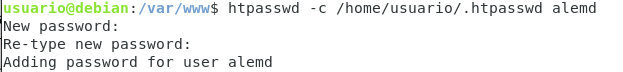

Una vez creado los usuarios, haremos que esté operativo en nuestro servidor y cada vez que accedemos a la web nos pedirá usuario y contraseña. 

Para ello, tenemos que editar el fichero de configuración de apache.

`   # sudo nano /etc/apache2/apache2.conf`

Añadimos lo siguiente

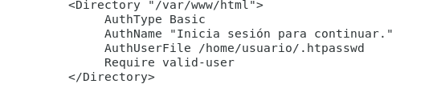

Como podemos comprobar al acceder a la web, nos pide autenticación.

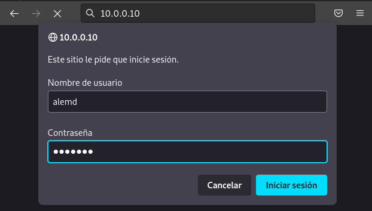

Una vez probado que el login de nuestro servidor apache está funcionando, es hora de intentar crackear los hashes del archivo htpasswd.

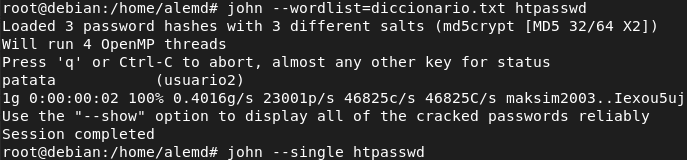

**Funcionamiento en Mysql.**

No consigo obtener los hashes de mysql, así que probaremos una función de mysql que encripta como un hash de mysql. En nuestra base de datos probamos lo siguiente y nos devolverá un hash mysql.

`	 # select passwd(‘contraseña’);`

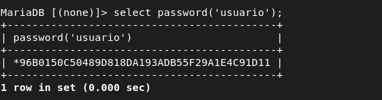

Creamos un fichero con el siguiente formato: *usuario:\*password*. Probaremos a con varios usuarios y contraseñas y ejecutaremos john para ver cuántas contraseñas resuelve.

Al ejecutar john, podemos observar que nos ha crackeado 2 contraseñas.

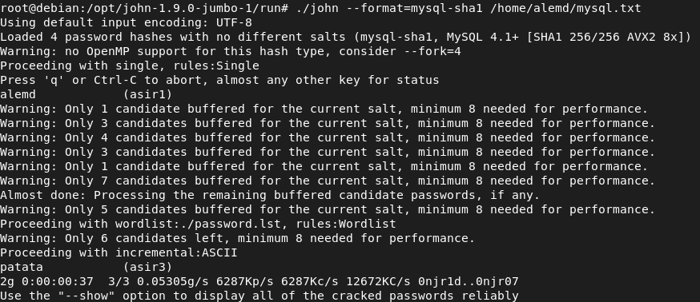

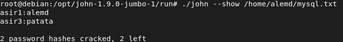

**Los archivos más importantes de John The Ripper**.

En el directorio /root/.jon nos aparecen tres archivos, llamados john.log, john.pot y john.rec.

- En el archivo john.log se registra todo lo que va haciendo john. Se puede mirar en tiempo real mientras john se ejecuta, para ello, usamos el siguiente comando:

`    # tail -f /root/.john/john.log`

- En el archivo john.pot se guardan las contraseñas que han sido crackeadas junto al hash.

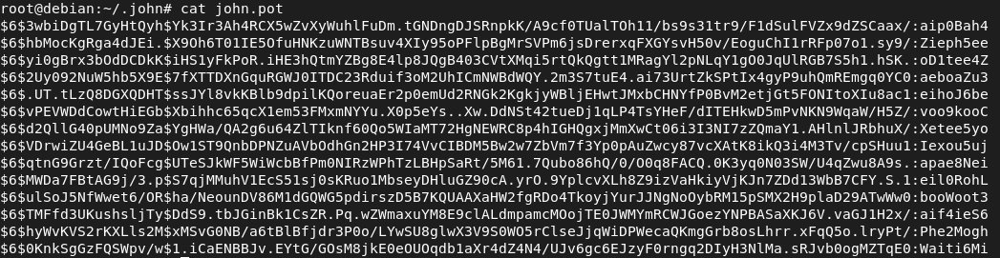

También se puede usar el comando john - -show nombrefichero para ver las contraseñas crackeadas.

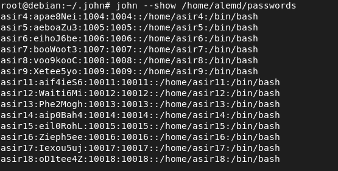

- John, utiliza el archivo john.rec para continuar por donde se había quedado en caso de que suceda algo inesperado. el comando para volver donde estaba es el siguiente:

`	 # john --restore`

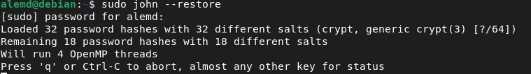

**Fichero de configuración en John The Ripper**

En el fichero john.conf(en mi máquina se encuentra en /etc/john/john.conf), se pueden establecer opciones globales, reglas para el modo wordlist y single crack, asignar valores a los parámetros del modo incremental e incluso definir modos externos de crackeo.

Este fichero está constituido por secciones, cada una de las cuales comienza por una línea donde está el nombre de la sección entre corchetes. Además se tiene que tener en cuenta lo siguiente:

- Los nombres de las variables y de las secciones no diferencian entre mayúsculas y minúsculas.
- Las líneas de comentarios comienzan por una almohadilla (**#**) o un punto y coma (**;**).

La sección general se llama *[Options]*, y se utiliza para asignar valores a ciertas variables que utiliza John, por ejemplo:

- Wordlist: Con esta opción se indica cuál será el diccionario que utilizará John en el modo wordlist cuando no se especifique ninguno en la línea de comando. Por defecto es el fichero *password.lst*.
- Idle: Se utiliza para indicar si JtR utilizará únicamente ciclos inactivos de las CPU o no.
- Save: Indica el número de segundos tras los cuales se guarda el estado en el que se encuentra el proceso de descifrado, y así, si el ordenador se bloqueara, se podría continuar a partir de ese punto y no se tendría que empezar de nuevo todo el proceso. Por defecto son 600 segundos.
- Beep: Indica si se quiere que JtR emita un pitido cada vez que se descifre una contraseña.

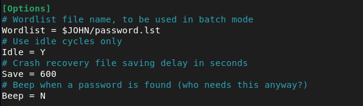


Las reglas que utilizan los modos *wordlist* y *single crack* para generar las palabras que se utilizarán para descubrir las contraseñas, se especifican en secciones independientes, concretamente en las secciones *[List.Rules.Wordlist]* y *[List.Rules.Single]*, respectivamente. Estas reglas, una por línea, se aplican a cada una de las palabras del diccionario en el modo *wordlist*, y a la información extraída del fichero */etc/passwd* en el modo *single crack*.

Reglas Single Crack:

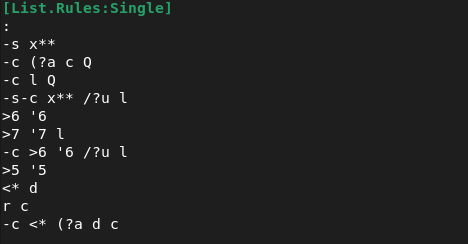

Reglas wordlist:

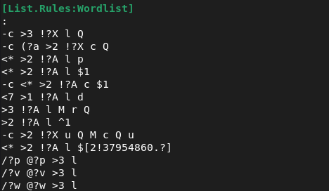

Para definir los parámetros del modo *incremental*, es necesario crear una sección usando [Incremental:NAME], donde NAME es el nombre del modo incremental que se está parametrizando.

Algunas de las variables que pueden asignarse son las siguientes:

- File: Especifica el fichero que contiene el conjunto o juego de caracteres con el que se formarán las contraseñas.
- MinLen: Indica la longitud de la contraseña más pequeña. Por defecto 0 (cadena vacía).
- MaxLen: Indica la longitud de la contraseña más larga. Por defecto 8.
- CharCount: Establece la cantidad de caracteres distintos como mínimo que poseerá el juego de caracteres. Si tiene menos, se producirá un error.
- Extra ***=*** Caracteres: Especifica algunos caracteres extra, distintos a los del juego de caracteres, que podrán ser usados para formar las potenciales contraseñas, aunque JtR tendrá en cuenta que estos caracteres aparecen con menos frecuencia en las contraseñas.

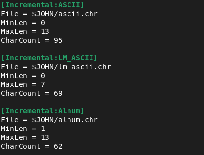

John trabaja también en un cuarto modo denominado externo, para lo cual se debe crear la sección *[List.External:NAME]*. En esta sección lo que hay que hacer es definir completamente el funcionamiento del modo mediante el desarrollo de las funciones init(), filter(), generate() y restore(). Estas funciones se deben codificar utilizando un lenguaje C reducido que el propio John incorpora y que puede compilar.

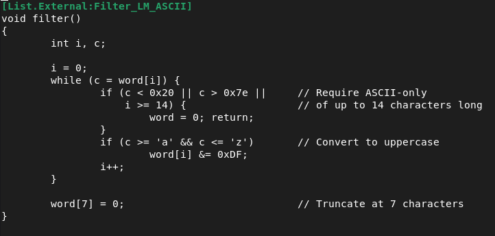
